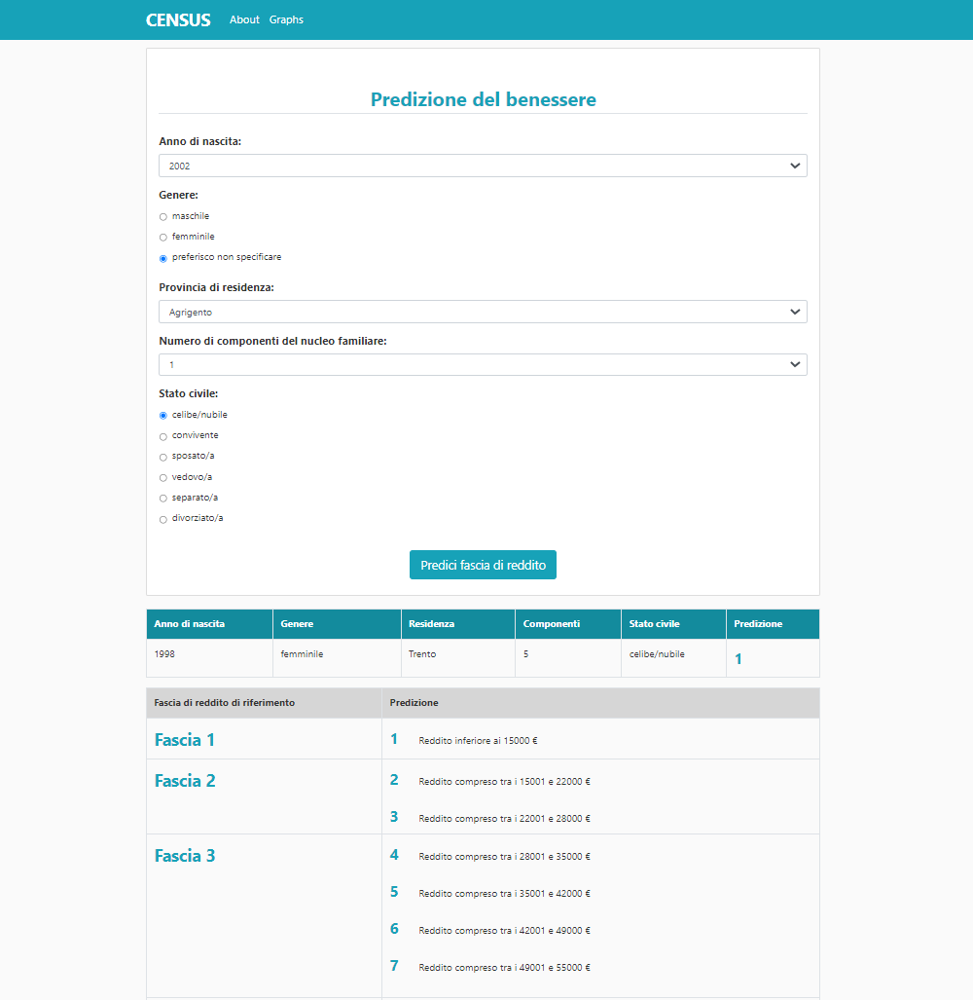

# C.E.N.S.U.S 
## *Calculator of Earnings Nationally Scored via User Specifics*
___

The C.E.N.S.U.S. project has been developed as final assignment of the Big Data Technologies course, offered by the University of Trento. 

## Project objective 
The project objective refers to deploying a Big Data system, taking as input specific user data and returning a prediction of his/her income group, subcategorizing the IRPEF system of taxation and its income segmentation. The prediction corresponds to the output of a Random Forest model trained with data provided by the Banca d’Italia and by the Sole24ore.
Specifically, the datasets employed are: 

- Banca d'Italia, Indagine sui bilanci delle famiglie italiane, [Indagine sul 2016](https://www.bancaditalia.it/statistiche/tematiche/indagini-famiglie-imprese/bilanci-famiglie/distribuzione-microdati/ricerca/ricerca.html?min_anno_pubblicazione=2018&max_anno_pubblicazione=2018) whose data refers to the 2016 survey 

- Banca d'Italia, Indagine sui bilanci delle famiglie italiane, [Indagine sul 2014](https://www.bancaditalia.it/statistiche/tematiche/indagini-famiglie-imprese/bilanci-famiglie/distribuzione-microdati/ricerca/ricerca.html?min_anno_pubblicazione=2015&max_anno_pubblicazione=2015) with data referring to the survey of 2014

- Lab24: [Qualità della vita](https://lab24.ilsole24ore.com/qualita-della-vita/) 

Whereas the Banca d’Italia offered a large amount of data per survey, only three datasets have been retained: **carcom**, containing the generalties of people who taken part into the survey, **rper**, individual income, and **rfam**, income per household. The variable descriptions, along with the survey items, can be found in the [Documentazione per l’utilizzo dei microdati](https://www.bancaditalia.it/statistiche/tematiche/indagini-famiglie-imprese/bilanci-famiglie/documentazione/index.html).             

## Prerequisites 

In order to run this project, the following tools have been installed on your machine: 
- Python, preferably [3.9](https://www.python.org/downloads/release/python-390/) 
- [Docker Desktop](https://www.docker.com/), preferably 3.5
- [Docker Compose](https://docs.docker.com/compose/install/) v1.27.0 and newer

Older versions of `docker-compose` do not support all features required by the `docker-compose.yml` file, so check that the minimum version requirements are satisied.

## Installation 

### Clone the repository 

Clone this repository to a local directory typing in the command line: 

```
git clone https://github.com/elypaolazz/BDT-Project.git
```

### Environment 
The creation of a virtual environment is highly suggested. It can be created tipying in the command line (inside the project folder): 

```
virtualenv venv
```

The command above created a virtual environment named *venv*, which can be activated as follow.  

- in Unix systems:
    ```
    source venv
    ```

- in Windows systems:
    ```
    venv\Scripts\activate
    ```
### Requirements 

In the running virtual environment, install all libraries contained in the `requirements.txt` file:

```
pip install -r requirements.txt
```

## Usage

This project employs few Docker images: 
-	the official [apache-airflow Docker](https://hub.docker.com/r/apache/airflow) image with a Celery Executor and using the official [Postgres](https://hub.docker.com/_/postgres/) as backend and [Redis](https://hub.docker.com/_/redis/) as message broker.
 
-	the official [mysql](https://hub.docker.com/_/mysql) along with its web interface [phpmyadmit](https://hub.docker.com/_/phpmyadmin). 

-	the Docker image [shaynativ/redis-ml](https://hub.docker.com/r/shaynativ/redis-ml) that contains both the Redis server and the Redis ML module, used during the Machine Learning procedure. 

If running on **Linux** system, a further check for deploying Airflow is needed. The mounted volumes (in the `docker-compose.yml` file) use the user/group permissions, therefore double-check if the container and the host computer have matching file permissions.
```
mkdir ./dags  ./logs 
echo -e „AIRFLOW_UID=$(id -u) \nAIRFLOW_GID=0” > .env
```

### Activate Docker images 

On **all operating systems**, initialize the project running:
```
docker-compose up airflow-init  
```
The command above starts the database migrations and creates the Airflow user account passing as `username: airflow` and `password: airflow`. The initialization is complete when the message below appears:

```diff
# airflow-init_1   | Admin user airflow created 
# airflow-init_1   | 2.1.1
+ airflow-init_1 exited with code 0
```
Now is possible to start all the other services by typing:
```
docker-compose up 
```
If a detached mode is preferred: 
```
docker-compose up -d 
```
Furthermore, the logs are recalled with:
```
docker-compose logs [OPTIONAL: container name] 
```
**NOTE**:
The two-step procedure can be sidestepped by running the `docker-compose up -d` command only once. However, this shortcut implies a constant check of the containers' condition to detect when `airflow-init` exits:

```
docker-compose ps  
```
Specificaly, the resulting view should be the same as the screenshot below. 

--> immagine da inserire 

### Run the script 
After the virtual environment and the Docker images are set up, a last step must be manually performed. To start the entire data pipeline, type in the command line (with the activated virtual environment): 

```
python runner.py 
```

The pipeline will start following some steps: 
-	**ingestion phase**: the [requests](https://pypi.org/project/requests/) Python library downloads the data from the Banca d’Italia and Sole24ore websites 
-	**ETL phase**: a DAG in Airflow extracts relevant data, transforms it employing [pandas]( https://pandas.pydata.org/) Python library, and loads it to the MySQL database `project_bdt`
-	**storage phase**: data is stored in a MySQL server running in another container 
-	**machine learning**: data is processed using Redis ML module implementing a [Random Forest model](https://redislabs.com/blog/introduction-redis-ml-part-five/) 
-	**web application**: the C.E.N.S.U.S. web application is launched and can be visualized by clicking or copy-pasting the localhost (which will apperas in the terminal) link in the browser 
    

### Access to web servers 
Accessing each service web server is the recommended approach to monitor the pipeline development. The web servers can be accessed in the browser by navigating to: 

-	**Airflow** [http://localhost:8080](http://localhost:8080/) a first log-in may be necessary with the chosen credentials (the default credentials are `username: airflow` and `password: airflow`). 

-	**Flower** [http://localhost:5555](http://localhost:5555/) for monitoring the tasks assigned to the Celery worker.  

-	**phpMyAdmit** [http://localhost:8082](http://localhost:8082/), which handles the administration of MySQL. Also in this case, a log-in is required reporting the credentials chosen in the `docker-compose.yml`file (the default credentials are `server: mysql`, `user: root`, and `password: password`). 

### Access to C.E.N.S.U.S. web application 

A user can access the web application in two different ways: 

1. clicking on the lochalhost link returned at the end of the data pipeline 

2. connecting to the stable C.E.N.S.U.S web application, hosted on a server: [http://elisapaolazzi.pythonanywhere.com/]( http://elisapaolazzi.pythonanywhere.com/) 

The web application, reported below, predicts the income bracket of the user, following the [IRPEF](https://www.informazionefiscale.it/Irpef-2021-aliquote-scaglioni-calcolo-novita) categories and further sub-groups.  
Accessing to the web application, you will see this page:



## Close the project 
The script will automatically end with the deployment of the web application. However, a manual stop of the Docker containers is needed using the command: 

```
docker-compose down 
```
# Code structure

The backend code structure is composed by:
-   `airflow` folder, containing the dags files (pipeline)
-   `R_graph_scripts` folder, containing the R scripts for the interface plots  
-   `src`, containing python files that include important function for the data collection, ingestion and machine learning phases
-   `docker-compose.yml`, docker file that defines the docker containers structure 
-   `runner.py`, pyhton file for dags triggering

## Interface code structure
The system interface is a Flask web application composed by:
-   `main.py`, python file containing the function needed to launch the application in the local server and the route functions (that define variables, actions and events) of the different pages 
-   `forms.py`, file that defines and manages the application forms and their fields
-   `templates folder`, containing the HTML files for each page template
-   `static folder`, containing the CSS file for the presentation (layout, colors, and fonts) and the images

## Overall code structure
```
├── airflow
│   └── dags
│   	  ├── first_dag.py
│   	  ├── second_dag.py
│   	  └── third_dag.py
│
├── R_graph_scripts
│   ├── internet_map_graph.Rmd
│   ├── prezzo_abitaz_map_graph.Rmd
│	├── spazio_abitazz_map_graph.Rmd
│   └── spesa_fam_map_graph.Rmd
│ 
├── src
│   ├── classifier.py
│   ├── collector.py
│	├── province_ita.json
│   └── saver.py
│ 
├── static
│    ├── main.css
│    ├── grraph.png
│    └── ...
│
├── templates
│    ├── about.htm
│    ├── home.htm
│    ├── layout.htm
│    └── line_chart.htm
│
├── .gitignore
├── docker-compose.yml
├── forms.py
├── main.py
├── requirements.txt
└── runner.py
```


# VARIABILI nella tabella "FINAL" ovvero l'unione di 2016-2014 (dal 2014 provengono solo le fam che poi hanno abbandonato il questionario) 
 
NQUEST and NORD: The primary key to merge household level information is NQUEST (household ID). 
NQUEST must be considered together with NORD (ID of each household member) to merge individual level 
information. 

NCOMP: numero di componenti per famiglia 

SEX: maschio 1, femmina 2 

ANASC: anno di nascita 

STACIV: stato civile 
Stato civile del rispondente STACIV
> Celibe/nubile 1
> Convivente 2
> Sposato/sposata 3
> Vedovo/vedova 4
> Separato/separata 5
> Divorziato/Divorziata 6

!!!! PRIMA DI ATTIVARE FLASK !!!!

1. Far partire docker 

# per bloccare DOCKER 
docker-compose stop 

# per bloccarlo definitivamente 
docker-compose down 

2. Nel file training-classifier seguire le istruzioni e runnare i 4 modelli (si salvaranno nella RAM) 

3. Dopo aver fatto runnare tutti e 4 i modelli, attivare flask nel solito modo  
